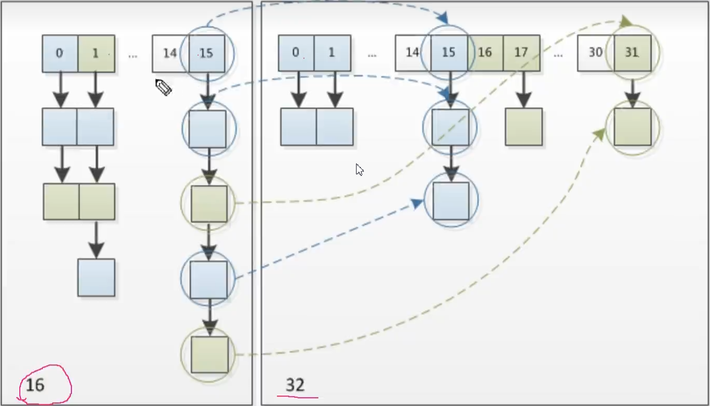
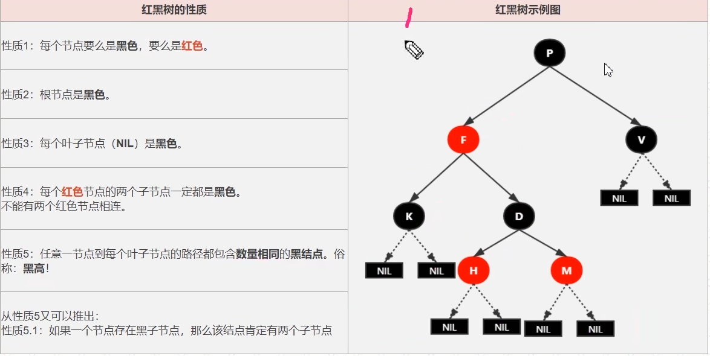
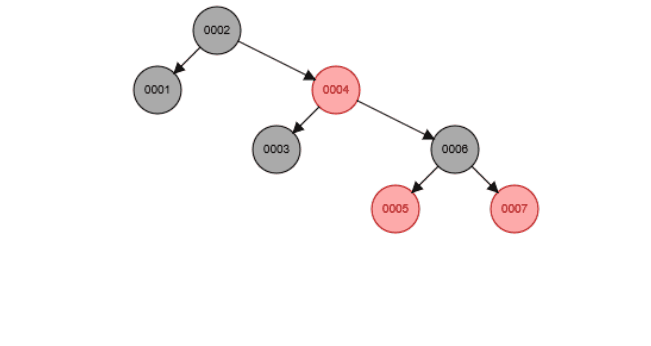
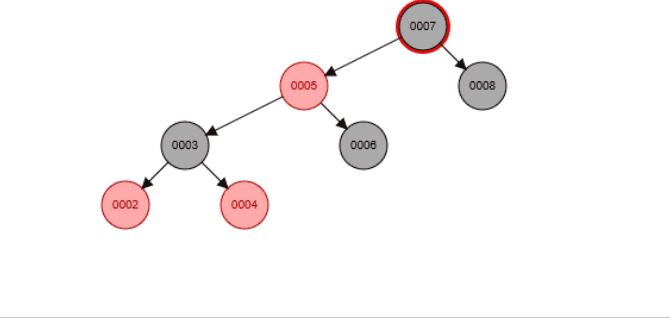
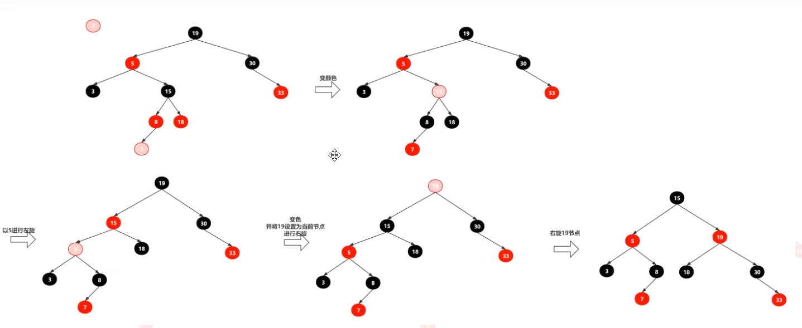

# HashMap

## 容量与负载因子

​	HashMap默认初始容量是16，长度始终保持[2的n次方](https://so.csdn.net/so/search?q=2的n次方&spm=1001.2101.3001.7020)，加载因子为0.75，扩容增量：原容量的1倍。

如果我们直接设置初始大小为实际存储的数量的话，HashMap并不会使用我们传进来的 initialCapacity  直接作为初识容量。JDK 会默认帮我们计算一个相对合理的值当做初始容量。所谓合理值，其实是找到第一个比用户传入的值大的 2  的幂。比如传7的话，JDK 会通过计算，帮我们创建一个容量为 8 的 Map,传9的话，JDK 会通过计算，帮我们创建一个容量为16的 Map。

​	**实际存储的数量 >initialCapacity *0.75时 会进行扩容**，每次扩容都需要重建[hash表](https://so.csdn.net/so/search?q=hash表&spm=1001.2101.3001.7020)，是非常影响性能的。同样设置过大浪费内存，因此设置一个合适的初始容量是有必要的。

~~~java
 static final int DEFAULT_INITIAL_CAPACITY = 1 << 4; // aka 16
//可以对桶进行树化的最小表容量。(否则，如果一个bin中的节点太多，则会调整表的大小。)应该至少为4 TREEIFY_THRESHOLD，以避免调整大小和树化阈值之间的冲突。
// 也就是说如果桶的数量较少 也不会树化
static final int MIN_TREEIFY_CAPACITY = 64;
~~~

## 多线程与HashMap

~~~java
 //这个类的所有“集合视图方法”返回的迭代器都是快速失败的:如果在迭代器创建后的任何时间，以除通过迭代器自己的remove方法之外的任何方式修改映射，迭代器将抛出ConcurrentModificationException。因此，在面对并发修改时，迭代器会快速而干净地失败，而不是在未来不确定的时间冒任意的、不确定的行为的风险。
Map m = Collections.synchronizedMap(new HashMap(...))

~~~

## Put

~~~java
// hash的是key 返回值是相同key的旧值
public V put(K key, V value) {
        return putVal(hash(key), key, value, false, true);
    }
// 做16位异或运算 目的是让在数据不是很大的时候(16,32,64)高16位也能参与进来数据的存储
static final int hash(Object key) {
        int h;
        return (key == null) ? 0 : (h = key.hashCode()) ^ (h >>> 16);
    }
~~~

~~~java
final V putVal(int hash, K key, V value, boolean onlyIfAbsent,
                   boolean evict) {
        Node<K,V>[] tab; Node<K,V> p; int n, i;// tab 当前HashMap 散列表  // p 当前散列表的元素 //n 散列表数组的长度 //i 路由寻址
        if ((tab = table) == null || (n = tab.length) == 0)//延迟初始化
            n = (tab = resize()).length;
        if ((p = tab[i = (n - 1) & hash]) == null)// 路由到的位置为空 直接赋值
            tab[i] = newNode(hash, key, value, null);
        else {
            Node<K,V> e; K k;
            if (p.hash == hash &&
                ((k = p.key) == key || (key != null && key.equals(k))))
                e = p;// key相等 将p赋值给e
            else if (p instanceof TreeNode)// 如果key值不相等 而且值的结构是红黑树
                e = ((TreeNode<K,V>)p).putTreeVal(this, tab, hash, key, value);
            else {// 如果key值不相等 值的结构是链表 链表的头元素与我们要插入的key不同
                for (int binCount = 0; ; ++binCount) {
                    if ((e = p.next) == null) {//末尾
                        p.next = newNode(hash, key, value, null);
                        if (binCount >= TREEIFY_THRESHOLD - 1) // -1 for 1st
                            treeifyBin(tab, hash);// 节点数超过8 进行树化操作
                        break;
                    }
                    if (e.hash == hash &&
                        ((k = e.key) == key || (key != null && key.equals(k))))// 遇到相同通的key
                        break;
                    p = e;
                }
            }
            if (e != null) { // existing mapping for key
                V oldValue = e.value;
                if (!onlyIfAbsent || oldValue == null)
                    e.value = value;
                afterNodeAccess(e);
                return oldValue;
            }
        }
        ++modCount;
        if (++size > threshold)
            resize();//扩容
        afterNodeInsertion(evict);
        return null;
    }
~~~

## resize扩容

~~~java
final Node<K,V>[] resize() {
        Node<K,V>[] oldTab = table;
        int oldCap = (oldTab == null) ? 0 : oldTab.length;// 数组长度
        int oldThr = threshold;// 扩容阈值
        int newCap, newThr = 0;
        if (oldCap > 0) {// 说明不是初始化
            if (oldCap >= MAXIMUM_CAPACITY) {
                threshold = Integer.MAX_VALUE;
                return oldTab;
            }
            else if ((newCap = oldCap << 1) < MAXIMUM_CAPACITY &&
                     oldCap >= DEFAULT_INITIAL_CAPACITY)
                newThr = oldThr << 1; // double threshold
        }// oldCap=0 新建HahsMap没有设置容量
        else if (oldThr > 0) // initial capacity was placed in threshold
            newCap = oldThr; 
        else {               // zero initial threshold signifies using defaults
            newCap = DEFAULT_INITIAL_CAPACITY;
            newThr = (int)(DEFAULT_LOAD_FACTOR * DEFAULT_INITIAL_CAPACITY);
        }
        if (newThr == 0) {// 通过组数长度和负载因子计算出一个新的值
            float ft = (float)newCap * loadFactor;
            newThr = (newCap < MAXIMUM_CAPACITY && ft < (float)MAXIMUM_CAPACITY ?
                      (int)ft : Integer.MAX_VALUE);
        }
        threshold = newThr;
        @SuppressWarnings({"rawtypes","unchecked"})
        Node<K,V>[] newTab = (Node<K,V>[])new Node[newCap];
        table = newTab;
        if (oldTab != null) {// 扩容之前 Tab不为null
            for (int j = 0; j < oldCap; ++j) {
                Node<K,V> e;
                if ((e = oldTab[j]) != null) {
                    oldTab[j] = null;
                    if (e.next == null)//数组就一个值
                        newTab[e.hash & (newCap - 1)] = e;
                    else if (e instanceof TreeNode)
                        ((TreeNode<K,V>)e).split(this, newTab, j, oldCap);
                    else { // preserve order
                        Node<K,V> loHead = null, loTail = null;
                        Node<K,V> hiHead = null, hiTail = null;
                        Node<K,V> next;
                        do {//根据 &(oldCap) 操作,让奇数位和偶数位链表均匀分布在新的数组上
                            next = e.next;//例如 下标为15的链表 奇数位链表还在15 偶数位的放在了31上
                            if ((e.hash & oldCap) == 0) {
                                if (loTail == null)
                                    loHead = e;
                                else
                                    loTail.next = e;
                                loTail = e;
                            }
                            else {
                                if (hiTail == null)
                                    hiHead = e;
                                else
                                    hiTail.next = e;
                                hiTail = e;
                            }
                        } while ((e = next) != null);
                        if (loTail != null) {
                            loTail.next = null;
                            newTab[j] = loHead;
                        }
                        if (hiTail != null) {
                            hiTail.next = null;
                            newTab[j + oldCap] = hiHead;
                        }
                    }
                }
            }
        }
        return newTab;
    }
~~~

头插法? 尾插法?

## get方法

## remove

## 红黑树

### 性质

1. 根节点是黑色
2. 每个红色节点的两个节点必须为黑色,两个红色的节点不能相连.
3. 任意一节点到每个叶子节点的路径都必须包含**数量相同**的黑节点.

### 操作

1. 左旋
   1. 
2. 右旋
   1. 
3. 变色	
4. 规律:
   1. 
   2. 如果有红色节点相连(7和8),看红色父节点右节点是否是红色(16),如果是红色就进行变色.
   3. 再看父红色节点的有节点是否为红色(30),如果是黑色,就进行左旋(以5为节点).变成LL双红
   4. 变色,以黑色节点进行右旋(以19为节点).
   5. 你给我当爸爸,我儿子就是你儿子.
