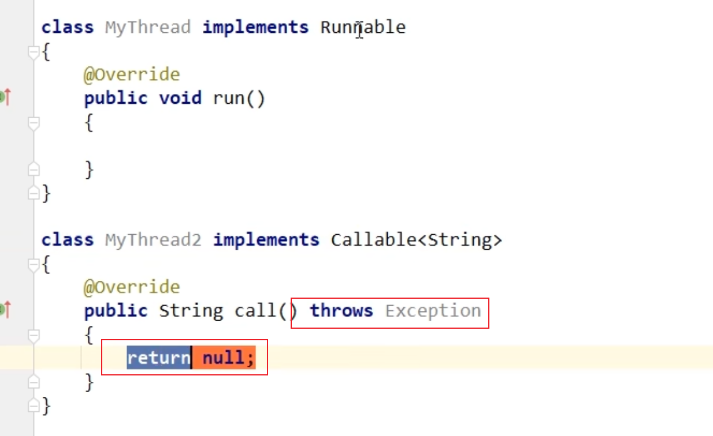
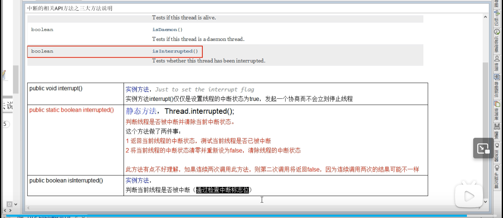
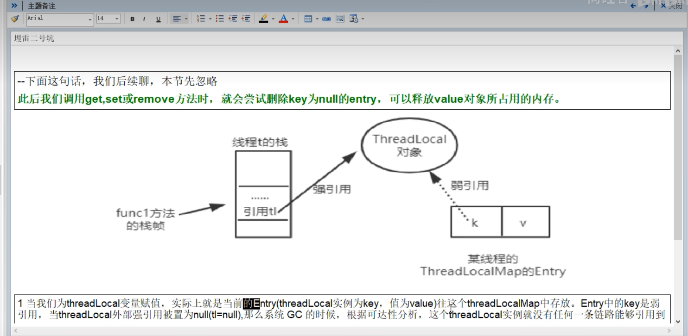
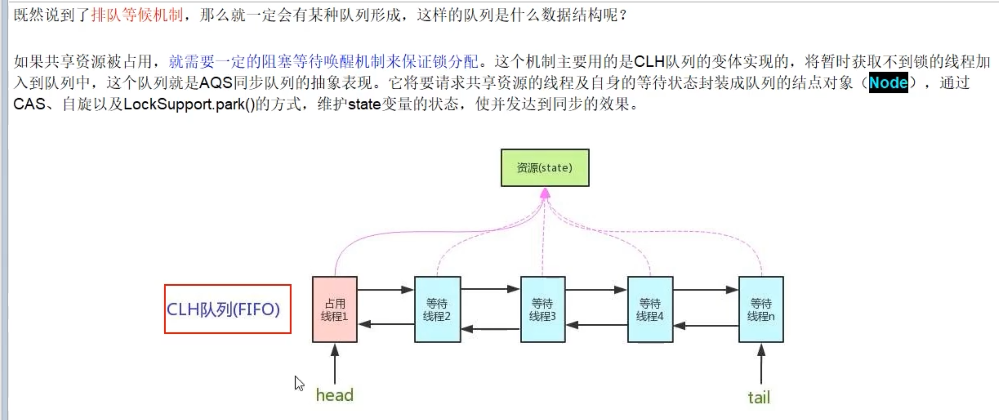
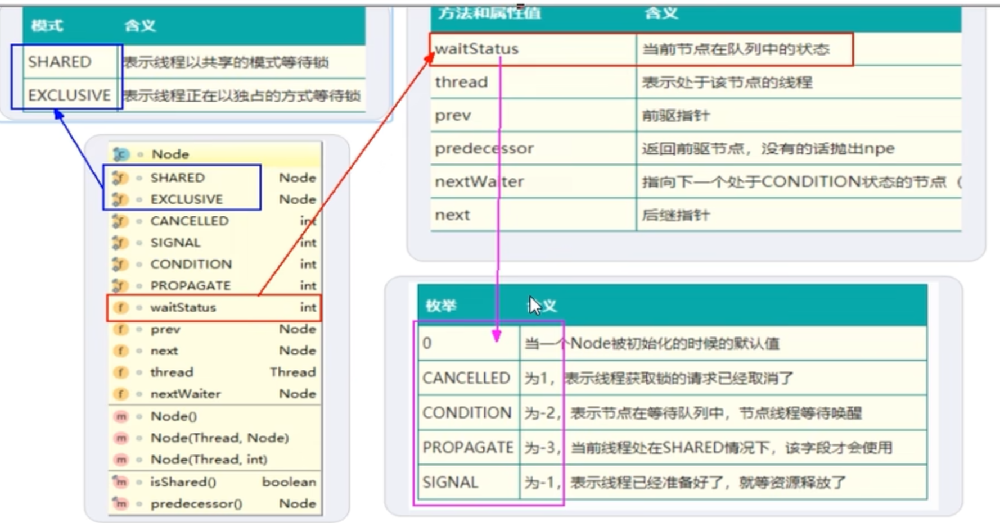
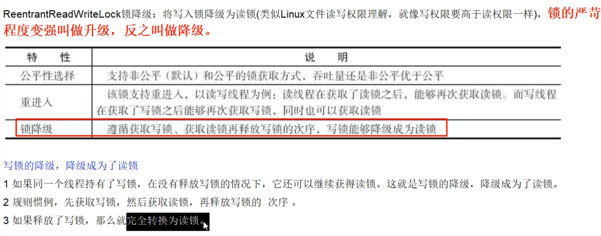

# JUC并发编程

## Future 

异步并行计算功能.

1. Runable VS Callable:callable 有返回值 有异常



### FutureTask

1. get()方法容易导致堵塞

   1. ~~~java
      public static void main(String[] args) throws ExecutionException, InterruptedException {
              FutureTask<String> stringFutureTask = new FutureTask<String>(()->{
                  TimeUnit.SECONDS.sleep(5);
                  return "hello world";
              });
              new Thread(stringFutureTask).start();
              System.out.println(stringFutureTask.get());
          }
      ~~~

2. 结果中有相互依赖以及只需要获取最快的结果都不太好用 引入了ComplateFuture.

   1. ~~~java
      public static void main(String[] args) throws ExecutionException, InterruptedException {
      //        runAsyncExecutorService();
              CompletableFuture<String> firstRunning = CompletableFuture.supplyAsync(() -> {
                  System.out.println(Thread.currentThread().getName());
                  try {
                      TimeUnit.SECONDS.sleep(1);
                  } catch (InterruptedException e) {
                      e.printStackTrace();
                  }
                  System.out.println("CompletableFutureFirst running");
                  return "CompletableFutureFirst task over!!";
              });
      
              System.out.println(firstRunning.get());
          }
      
          private static void runAsyncExecutorService() throws InterruptedException, ExecutionException {
              ExecutorService executorService = Executors.newFixedThreadPool(3);
              CompletableFuture<Void> completableFuture = CompletableFuture.runAsync(() -> {
                  System.out.println(Thread.currentThread().getName());
                  try {
                      TimeUnit.SECONDS.sleep(1);
                      System.out.println("CompletableFutureFirst run");
                  } catch (InterruptedException e) {
                      e.printStackTrace();
                  }
              }, executorService);
              System.out.println(completableFuture.get());
              executorService.shutdown();
          }
      ~~~

   2. supplyAsync 没有返回值 runAsync  有返回值

   3. 完成时候 以及未完成情况下的处理

      1. ~~~java
         public class CompletableFutureSecond {
         
             public static void main(String[] args) throws ExecutionException, InterruptedException {
                 ExecutorService threadPool = Executors.newFixedThreadPool(3);
                 try {
                     CompletableFuture<Integer> completableFuture = CompletableFuture.supplyAsync(() -> {
                         int result = ThreadLocalRandom.current().nextInt(10);
                         try {
                             TimeUnit.SECONDS.sleep(1);
                         } catch (InterruptedException e) {
                             e.printStackTrace();
                         }
                         System.out.println("-----1秒钟后出现了结果!!!" + result);
                         if (result > 5) {
                             int i = 10 / 0;
                         }
                         return result;
                     }, threadPool).whenComplete((v, e) -> {
                         if (e == null) {
                             System.out.println("-----计算完成,更新系统updateV:" + v);
                         }
                     }).exceptionally(e -> {
                         e.printStackTrace();
                         System.out.println("异常了: " + e.getCause() + "\t" + e.getMessage());
                         return null;
                     });
                 } catch (Exception e) {
                     e.printStackTrace();
                 } finally {
                     threadPool.shutdown();
                 }
         
             }
         
         }
         ~~~

   4. 几种对结果的处理

      1. | **方法**         | **核心功能**      | **入参**                        | **返回值**      | **遇到异常时是否执行？** |
         | ---------------- | ----------------- | ------------------------------- | --------------- | ------------------------ |
         | **`thenApply`**  | 转换结果          | 正常结果 `T`                    | 新结果 `U`      | ❌ 跳过                   |
         | **`thenAccept`** | 消费结果          | 正常结果 `T`                    | 无 (`Void`)     | ❌ 跳过                   |
         | **`thenRun`**    | **纯粹触发**      | **无 (不接任何参数)**           | **无 (`Void`)** | ❌ **跳过**               |
         | **`handle`**     | 结果转换+异常处理 | 正常结果 `T` + 异常 `Throwable` | 新结果 `U`      | ✅ 始终执行               |

      2. | **方法**                  | **执行线程**                   | **核心特点**                                                 |
         | ------------------------- | ------------------------------ | ------------------------------------------------------------ |
         | **`thenRun`** (同步)      | **上一步的线程** 或 **主线程** | “顺手把活干了”。不切换线程，开销小，但容易阻塞当前线程。     |
         | **`thenRunAsync`** (异步) | **线程池中的新线程**           | “把活外包出去”。强制切换到另一个线程执行，不会阻塞当前步骤的线程。 |

3. .thenComine() 将两个结果进行合并

## CompletableFuture

### FutureTask


2. FutureTask 实现了 RunableFuture,构造方法还需要传递一个Callbale,所以他是回调/异步/多线程 都能具有的类.

### Future 的缺点

1. ~~~java
   public class DisadvantageFuture {
       public static void main(String[] args) throws ExecutionException, InterruptedException {
           FutureTask<String> task = new FutureTask<>(() -> {
               System.out.println("执行了");
               TimeUnit.SECONDS.sleep(3);
               return "task over";
           });
           Thread thread = new Thread(task);
           thread.start();
           System.out.println(Thread.currentThread().getName() + "执行其他的任务去了");
       //    task.get();
      //   task.get(2, TimeUnit.SECONDS);
            while (true) {
               if (task.isDone()) {
                   System.out.println(task.get());
                   break;
               }else {
                   TimeUnit.SECONDS.sleep(1);
                   System.out.println("正在轮询.....");
               }
           }
       }
   }
   ~~~

2. get()容易导致阻塞,一般建议放在程序的后面.

3. 轮询耗费CPU的资源.

### CompletableFuture

1. 两种创建CompletableFuture的方式

   1. ```java
      public class CompletableFutureFirst {
          public static void main(String[] args) throws ExecutionException, InterruptedException {
      //        runAsyncExecutorService();
              CompletableFuture<String> firstRunning = CompletableFuture.supplyAsync(() -> {
                  try {
                      TimeUnit.SECONDS.sleep(1);
                  } catch (InterruptedException e) {
                      e.printStackTrace();
                  }
                  System.out.println("CompletableFutureFirst running")    ;
                  return "CompletableFutureFirst task over!!";
              });
      
              System.out.println(firstRunning.get());
          }
      
          private static void runAsyncExecutorService() throws InterruptedException, ExecutionException {
              ExecutorService executorService = Executors.newFixedThreadPool(3);
              CompletableFuture<Void> completableFuture = CompletableFuture.runAsync(() -> {
                  System.out.println(Thread.currentThread().getName());
                  try {
                      TimeUnit.SECONDS.sleep(1);
                      System.out.println("CompletableFutureFirst run");
                  } catch (InterruptedException e) {
                      e.printStackTrace();
                  }
              }, executorService);
              System.out.println(completableFuture.get());
              executorService.shutdown();
          }
      
      }
      // runAsync 方法没有返回值  supplyAsync 方法有
      ```

2. 案例优化,比较FutureTask不需要轮询,就能获取结果

   1. ~~~java
      public class CompletableFutureSecond {
      
          public static void main(String[] args) throws ExecutionException, InterruptedException {
      //        first();
              ExecutorService threadPool = Executors.newFixedThreadPool(3);
              try {
                  CompletableFuture<Integer> completableFuture = CompletableFuture.supplyAsync(() -> {
                      int result = ThreadLocalRandom.current().nextInt(10);
                      try {
                          TimeUnit.SECONDS.sleep(1);
                      } catch (InterruptedException e) {
                          e.printStackTrace();
                      }
                      System.out.println("-----1秒钟后出现了结果!!!" + result);
                      if (result > 5) {
                          int i = 10 / 0;
                      }
                      return result;
                  }, threadPool).whenComplete((v, e) -> {
                      if (e == null) {
                          System.out.println("-----计算完成,更新系统updateV:" + v);
                      }
                  }).exceptionally(e -> {
                      e.printStackTrace();
                      System.out.println("异常了: " + e.getCause() + "\t" + e.getMessage());
            	 		           return null;
                  });
              } catch (Exception e) {
                  e.printStackTrace();
              } finally {
                  threadPool.shutdown();
              }
          }
      
          private static void first() throws InterruptedException, ExecutionException {
              CompletableFuture<Integer> completableFuture = CompletableFuture.supplyAsync(() -> {
                  int result = ThreadLocalRandom.current().nextInt(10);
                  try {
                      TimeUnit.SECONDS.sleep(1);
                  } catch (InterruptedException e) {
                      e.printStackTrace();
                  }
                  System.out.println("-----1秒钟后出现了结果!!!" + result);
                  return result;
              });
              System.out.println(Thread.currentThread().getName() + "忙其他的线程去了!!!");
              System.out.println(completableFuture.get());
          }
      
      }
      ~~~

   2. 接收结果后处理

      1. ~~~java
         public class CompletableFutureResult {
         
             public static void main(String[] args) {
                 CompletableFuture.supplyAsync(() -> 1)
                         .thenApply(a -> a + 2)
                         .whenComplete((ele, throwable) -> {
                     System.out.println(ele);
                     String s = throwable.getMessage() + ":" + throwable.getCause();
                     System.out.println(s);
                 });
             }
         }
         // thenApply 将结果进行返回
         // handle 正常的情况下 和thenApply一样,只有异常的时候,即使遇到了异常,也能执行之后的步骤.
         // handle 一般是必须要执行的步骤  例如关流
         ~~~

      2. thenRun,不需要上一步的结果,也没有返回结果,thenAccept 需要上一步结果,自己没有结果.thenApply 需要上一步结果,也有返回值.

      3. join和get一样都可以返回得到执行的结果,但是join不会报异常.

      4. thenRunAsync() 调用的时候,需要自定义线程池,才行实现多线程的调用.第一个任务,使用的自定义的线程池,之后的步骤使用的是CommonPool线程池.也就是默认的线程池.thenRun(),方法,只会调用上一个步骤的线程.

      5. 异步回调的时候需要传出我们自己的线程池.

      6. 线程池循环容易导致死锁,即 CompletableFuture.supplyAsync在调用 CompletableFuture.supplyAsync,当CommonPool线程打满,而子线程还在等待释放线程,而主线程又等待子线程执行完任务后在释放线程,循环等待,导致死锁.

         1. ~~~java
            public Object doGet() {
              ExecutorService threadPool1 = new ThreadPoolExecutor(10, 10, 0L, TimeUnit.MILLISECONDS, new ArrayBlockingQueue<>(100));
              CompletableFuture cf1 = CompletableFuture.supplyAsync(() -> {
              //do sth
                return CompletableFuture.supplyAsync(() -> {
                    System.out.println("child");
                    return "child";
                  }, threadPool1).join();//子任务
                }, threadPool1);
              return cf1.join();
            }
            ~~~

         2. 

1. 

## 锁

### 锁静态方法

1. 方法被static修饰并且有synchronize 等效于锁了整个对象 所以不同的对接调用也需要等待.

### 锁位置的区别

1. 

2. 类锁和方法锁的是两个平级不同的锁

   1. **在 Java 的世界里，并非如此。类锁和实例锁是完全平级、互不干涉的两把锁，它们之间没有任何“父子”或“包含”关系。**

      我们可以通过以下几个层面来彻底击碎这个误区：

      1. 核心原理：它们根本不是同一个“门”

      在 JVM 的底层实现中，任何一个对象都可以作为锁（Monitor）。

      - **类对象 (`MyObject.class`)**：它在 JVM 内存的堆中是一个独立存在的对象。
      - **实例对象 (`new MyObject()`)**：它在堆中也是一个独立存在的对象。

### Synchronize锁

1. 加在同步代码块
   1. monitorEnter
   2. monitorExist
2. 方法
   1. ACC_Synchronize 方法上有标识
3. 类上或者静态同步方法
   1. ACC_Synchronize  同时有ACC_Static标识
4. ObjectMonitor关键属性 
   1. 
   2. 与对象有对应的关系.

### LockSupport

1. java用于停止线程的协商机制----中断标识协商机制.**不是强制**

2. 

3. 实现线程等待和唤醒机制 

   1. 如果想使用wait和notify必须将他们包在锁内.
   2. 需要先wait 在执行notify.

4. `Condition` 完全理解为传统 `synchronized` 代码块里的 `Object.wait()` 和 `Object.notify()` 的**高级升级版**。

   1. | **传统方式 (synchronized 锁对象)** | **Condition 方式 (Lock 的条件变量)** | **作用**                                 |
      | ---------------------------------- | ------------------------------------ | ---------------------------------------- |
      | `object.wait()`                    | **`condition.await()`**              | 释放锁，并让当前线程进入等待（睡眠）状态 |
      | `object.notify()`                  | **`condition.signal()`**             | 随机唤醒**一个**在这个条件上等待的线程   |
      | `object.notifyAll()`               | **`condition.signalAll()`**          | 唤醒**所有**在这个条件上等待的线程       |

#### LockSupport VS  Lock的Condition 

**1.核心机制：是否有“锁”的束缚？**

- **`Condition` (`await/signal`)**：**强制绑定锁**。你必须先 `lock.lock()` 拿到锁，才能调用 `await()`，否则直接抛出 `IllegalMonitorStateException` 异常。
- **`LockSupport` (`park/unpark`)**：**完全自由，不需要锁**。它可以在代码的任何地方让当前线程暂停，不需要先获取任何对象的 Monitor 或 Lock。

**2.唤醒目标的精准度：范围广播 vs 狙击枪**

- **`Condition`**：调用 `signal()` 时，你**无法决定唤醒哪一个具体的线程**。它是随机唤醒（或按队列顺序唤醒）一个在当前 Condition 上等待的线程。
- **`LockSupport`**：精准打击。`unpark(Thread thread)` 方法**必须接收一个具体的线程对象作为参数**，指名道姓地唤醒目标线程。

**3.最致命的区别：先后顺序（“许可证”机制）**

这是 `LockSupport` 最强大、也是它能作为底层基石的最重要原因。

- **`Condition` (以及传统的 `wait/notify`) 的痛点**：必须先 `await()`，后 `signal()`。**如果顺序反了**（别人先发了信号，你后进入等待），这个信号就会丢失，你的线程将**永远阻塞**下去。这就很容易产生极其难查的死锁。
- **`LockSupport` 的“凭证”机制**： `LockSupport` 发放的是一种叫“Permit（许可）”的东西。
  - 调用 `unpark(thread)` 等于给这个线程发了一张通行证。
  - 调用 `park()` 等于遇到关卡检查通行证。
  - **即使顺序反了也完全没问题！** 如果先执行了 `unpark` 给线程发了通行证，当该线程后来执行到 `park()` 时，它会发现自己手里已经有通行证了，于是**直接放行，根本不会阻塞！**（注意：通行证最多只有1张，不能累加）。

**4.异常处理：是否抛出中断异常？**

- **`Condition.await()`**：如果线程在等待时被别的线程中断（`interrupt()`），它会立刻醒来并**抛出 `InterruptedException`**，你必须 `catch` 它。
- **`LockSupport.park()`**：如果线程被中断，它也会立刻醒来继续往下执行，但**不会抛出任何异常**。你需要自己通过 `Thread.interrupted()` 去检查刚才是不是被中断了。

## 原子类

### AtomicIntegerFileUpdater

1. 只对一个类中的一个属性进行操作(例如价格)  不用加synchronize也能实现线程安全

## ThreadLocal

### 定义

1. `ThreadLocal` 提供了一种**线程内部的局部变量**。线程私有的.

### Thead 与 ThreadLocal 以及 TheadLocalMap的关系

1. **`Thread` (员工)**：每一个在公司干活的员工（线程）。

   **`ThreadLocalMap` (私人储物柜)**：每个员工都有一个属于自己的私人储物柜，就背在自己身上。

   **`ThreadLocal` (储物柜里的专属标签/钥匙)**：比如“水杯标签”、“工牌标签”。

2. ~~~java
   // ThreadLocal 类中的 set 方法核心逻辑
   public void set(T value) {
       // 1. 获取当前正在执行代码的线程（员工）
       Thread t = Thread.currentThread(); 
       
       // 2. 从这个线程身上，掏出它自己的私人储物柜（Map）
       ThreadLocalMap map = getMap(t); 
       
       if (map != null) {
           // 3. 如果储物柜存在，就把【当前的 ThreadLocal 对象】作为 Key，把【数据】作为 Value 存进去
           map.set(this, value); 
       } else {
           // 4. 如果储物柜不存在，就帮这个线程建一个储物柜，并存入数据
           createMap(t, value);
       }
   }
   ~~~

3. ThreadLocalMap 键是ThreadLocal (this对象) 通过它来区分不同的线程之间的值.

### 为什么用弱引用

#### 什么是弱引用？

弱引用的意思是：只要垃圾回收器（GC）一启动，发现这个对象只有弱引用指着它，**不管内存够不够，直接把它干掉**。



#### 灾难是如何发生的？（内存泄漏推演）

假设你在 Tomcat 线程池里处理一个请求：

1. 你定义了一个 `ThreadLocal`，把它作为 Key，存进了一个很大的 `User` 对象（Value）到当前线程的 Map 里。
2. 你的业务代码跑完了，`ThreadLocal` 这个变量在外部没有引用了。
3. **GC 来了**：因为 `ThreadLocalMap` 里的 Key 是**弱引用**，所以 GC 毫不留情地把 `ThreadLocal` 对象清理掉了。此时，Map 里的 Key 变成了 `null`。
4. **死局形成**：但是！那个巨大的 `User` 对象（Value）是**强引用**。而且这个线程是线程池里的线程，**线程本身根本不会死**。
5. **结果**：线程不死 -> `ThreadLocalMap` 就不死 -> Map 里的 Entry 就不死。这就留下了一个 **Key 为 null，但 Value 还在占用内存的“僵尸数据”**。因为 Key 是 null，你再也无法通过代码访问到这个 Value，它永远驻留在内存里，这就是**内存泄漏**！

#### 怎么破局？

这就是为什么我上一局千叮咛万嘱咐：**必须手动调用 `threadLocal.remove()`！** 调用 `remove()`，其实就是主动去当前线程的 Map 里，把这一对 Key 和 Value 连根拔起、彻底删掉，不给 GC 留下任何擦屁股的隐患。

### 冲突解决

1. ThreadLocalMap:  使用"**线性探测法**".如果这个坑被别人占了，我就挨个往后找，直到找到一个空坑为止。
2. 为什么这样设计
   1. `ThreadLocalMap` 从根本上就不容易产生冲突！
   2. 在 `HashMap` 中，如果有无用的节点，你要去维护复杂的链表指针甚至红黑树节点的摘除操作，非常耗时。

### 强,软,弱,虚引用

1. 软引用 只有当内存不够的时候才回收.
2. 弱引用:不论内存是否租后 只要调用了System.gc() 就是被回收.
3. 虚引用:依赖队列 每次get都是null 不论如何都会被回收

## AQS原理以及源码

1. 整体是一个抽象的 FIFO队列来完成资源资源获取线程的排队工作.state表示状态 变体虚拟的双向队列

   1. 

2. ReentrantLock--> Sync-(继承)->AbstractQueuedSynchronizer 抽象队列锁 以及ReentrantLock对应的关系.

   - 

3. 加锁会导致阻塞,持有和释放锁通过AQS进行管理.底层是是队列和volatile修饰的int类型的state.

4. Node

   1. ~~~java
       static final class Node {
              /** Marker to indicate a node is waiting in shared mode */
              static final Node SHARED = new Node();
              /** Marker to indicate a node is waiting in exclusive mode */
              static final Node EXCLUSIVE = null;
         
              /** waitStatus value to indicate thread has cancelled */
              static final int CANCELLED =  1;
              /** waitStatus value to indicate successor's thread needs unparking */
              static final int SIGNAL    = -1;
              /** waitStatus value to indicate thread is waiting on condition */
              static final int CONDITION = -2;
              /**
               * waitStatus value to indicate the next acquireShared should
               * unconditionally propagate
               */
              static final int PROPAGATE = -3;
         
              /**
               * Status field, taking on only the values:
               *   SIGNAL:     The successor of this node is (or will soon be)
               *               blocked (via park), so the current node must
               *               unpark its successor when it releases or
               *               cancels. To avoid races, acquire methods must
               *               first indicate they need a signal,
               *               then retry the atomic acquire, and then,
               *               on failure, block.
               *   CANCELLED:  This node is cancelled due to timeout or interrupt.
               *               Nodes never leave this state. In particular,
               *               a thread with cancelled node never again blocks.
               *   CONDITION:  This node is currently on a condition queue.
               *               It will not be used as a sync queue node
               *               until transferred, at which time the status
               *               will be set to 0. (Use of this value here has
               *               nothing to do with the other uses of the
               *               field, but simplifies mechanics.)
               *   PROPAGATE:  A releaseShared should be propagated to other
               *               nodes. This is set (for head node only) in
               *               doReleaseShared to ensure propagation
               *               continues, even if other operations have
               *               since intervened.
               *   0:          None of the above
               *
               * The values are arranged numerically to simplify use.
               * Non-negative values mean that a node doesn't need to
               * signal. So, most code doesn't need to check for particular
               * values, just for sign.
               *
               * The field is initialized to 0 for normal sync nodes, and
               * CONDITION for condition nodes.  It is modified using CAS
               * (or when possible, unconditional volatile writes).
               */
              volatile int waitStatus;
       }
      ~~~

   2. Node的状态值代表的含义

5. 公平锁与非公平锁

   1. 公平锁.png)
   2. 
   3. 公平锁会优先让等待的队列中的node获取锁.

6. ReentrantLock可重入锁非公平锁的lock方法 

   1. ~~~java
      final void lock() {
                 if (compareAndSetState(0, 1))
                     setExclusiveOwnerThread(Thread.currentThread());
                 else
                     acquire(1);
             }
       public final void acquire(int arg) {
             if (!tryAcquire(arg) &&
                 acquireQueued(addWaiter(Node.EXCLUSIVE), arg))
                 selfInterrupt();
         }
      ~~~

   2. 锁主要由三个方法组成

      1. tryAcquire

         1. ~~~java
              final boolean nonfairTryAcquire(int acquires) {
                        final Thread current = Thread.currentThread();
                        int c = getState();
                        if (c == 0) {
                            if (compareAndSetState(0, acquires)) {
                                setExclusiveOwnerThread(current);
                                return true;
                            }
                        }
                        else if (current == getExclusiveOwnerThread()) {
                            int nextc = c + acquires;
                            if (nextc < 0) // overflow
                                throw new Error("Maximum lock count exceeded");
                            setState(nextc);
                            return true;
                        }
                        return false;
                    }
            ~~~

      2. addWaiter 

         1. 将node节点放入队列

      3. acquireQueued

         1. ~~~java
            final boolean acquireQueued(final Node node, int arg) {
                    boolean failed = true;
                    try {
                        boolean interrupted = false;
                        for (;;) {
                            final Node p = node.predecessor();
                            if (p == head && tryAcquire(arg)) {
                                setHead(node);
                                p.next = null; // help GC
                                failed = false;
                                return interrupted;
                            }
                            if (shouldParkAfterFailedAcquire(p, node) &&
                                parkAndCheckInterrupt())
                                interrupted = true;
                        }
                    } finally {
                        if (failed)
                            cancelAcquire(node);
                    }
                }
            
             private final boolean parkAndCheckInterrupt() {
                    LockSupport.park(this);
                    return Thread.interrupted();
                }
            
            ~~~

         2. 主要的作用是设置锁的状态. state=1  并将节点的waitStatus状态设置为-1 代表 已经准备好,随时可以调用.  

7. ReentrantLock可重入锁非公平锁的unlock方法 

   1. ~~~java
      protected final boolean tryRelease(int releases) {
                  int c = getState() - releases;
                  if (getExclusiveOwnerThread() != Thread.currentThread())
                      throw new IllegalMonitorStateException();
                  boolean free = (c == 0);
                  if (free)
                      setExclusiveOwnerThread(null);
                  setState(c);
                  return free;
              }
      ~~~


## 读锁与写锁

1. Lock.lock() 将所包含的业务进行串行,但是当有读取的时候,希望线程不阻塞,所有,创建了读锁和写锁,读读共享,读写互斥 .

```java
ReentrantReadWriteLock lock = new ReentrantReadWriteLock();
lock.readLock().lock();
lock.readLock().unlock();
lock.writeLock().lock();
lock.writeLock().unlock();
```

1. 锁降级:写锁降级为读锁 其实就是写锁的时候可以支持读锁的获取.



## 邮戳锁

1. 当读线程非常多，写线程很少的情况下，很容易导致写线程“饥饿”，也就是线程负责读任务,但是有一个写任务,只能一直等待读任务完成后,才能进行.

2. 解决的办法是实现了一个队列,每次不管是读锁也好写锁也好,未拿到锁就加入队列,然后每次解锁队列头存储的线程节点获取锁,以此避免饥饿。 

3. ~~~java
   class Point {
       private int x, y;
       final StampedLock sl = new StampedLock();
    
       //计算到原点的距离  
       double distanceFromOrigin() {
           // 乐观读
           long stamp = sl.tryOptimisticRead();
           // 读入局部变量，
           // 读的过程数据可能被修改
           int curX = x, curY = y;
           //判断执行读操作期间，
           //是否存在写操作，如果存在，
           //则sl.validate返回false
           if (!sl.validate(stamp)) {
               // 升级为悲观读锁
               stamp = sl.readLock();
               try {
                   curX = x;
                   curY = y;
               } finally {
                   //释放悲观读锁
                   sl.unlockRead(stamp);
               }
           }
           return Math.sqrt(curX * curX + curY * curY);
       }
   }
   ~~~

## Lock与Synchronized锁不同


## 线程池

### 实现原理


### 重要的参数


## 其它知识

1. 重写Thread和重写Runable接口的区别
   1. 继承Thread类的，我们相当于拿出三件事即三个卖票10张的任务分别分给三个窗口，他们各做各的事各卖各的票各完成各的任务，因为MyThread继承Thread类，所以在new MyThread的时候在创建三个对象的同时创建了三个线程；
   2. 实现Runnable的， 相当于是拿出一个卖票10张得任务给三个人去共同完成，new MyThread相当于创建一个任务，然后实例化三个Thread，创建三个线程即安排三个窗口去执行。
2. 为什么有这么多锁
   1. 引入事务,使用Lock 或者 Synchronized
   2. 发现读的时候不需要阻塞,甚至读写的时候需要区别处理,所以引入了读写锁,并设置了可重入的特性.
   3. 一般读多写少,导致写锁饥饿的问题,引入了邮戳锁.


