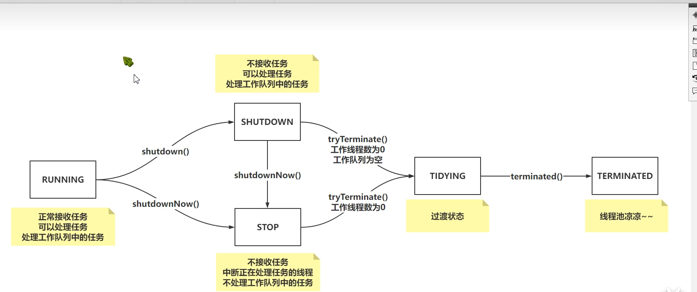

# JDK多线程学习

## 线程池的状态变换

## execute

~~~java
public void execute(Runnable command) {
        if (command == null)
            throw new NullPointerException();
        int c = ctl.get();
        if (workerCountOf(c) < corePoolSize) {// 工作线程数小于核心线程数
            if (addWorker(command, true))
                return;// 创建核心线程成功 返回线程数
            c = ctl.get();// 多线程下没有成功的线程,将c更新.
        }
    // double check
        if (isRunning(c) && workQueue.offer(command)) { // 大于核心线程数 将任务添加到队列
            int recheck = ctl.get();
            if (! isRunning(recheck) && remove(command))// 再次检验当前线程是RUNNING状态,如果不是就将任务移除
                reject(command);//因为状态异常,执行拒绝策略
            else if (workerCountOf(recheck) == 0) // 工作线程数为0  但是队列中有任务
                addWorker(null, false);//添加一个空任务 非核心线程
        }
        else if (!addWorker(command, false)) // 添加队列失败,让非核心线程执行任务
            reject(command);// 如果不成功 执行拒绝策略
    }
~~~

1. ~~~java
   else if (workerCountOf(recheck) == 0) addWorker(null, false); 
   ~~~

   如果线程池的状态是shutdown  工作线程数为0 但是队列中有任务,就添加非核心线程的空任务,让非核心线程处理队列中的任务.

## addWorker 添加任务

~~~java
   private boolean addWorker(Runnable firstTask, boolean core) {
        retry:
        for (;;) {
            int c = ctl.get();
            int rs = runStateOf(c);// 线程池的状态

            // Check if queue empty only if necessary.
            if (rs >= SHUTDOWN &&// 线程状态不是RUNNING
                ! (rs == SHUTDOWN && // 线程状态是SHUTDOWN 而且队列为空 第一个任务为空
                   firstTask == null &&
                   ! workQueue.isEmpty()))
                return false;// 不用执行任务

            for (;;) {
                int wc = workerCountOf(c);
                if (wc >= CAPACITY || // 工作线程大于最大值
                    wc >= (core ? corePoolSize : maximumPoolSize))// 工作线程数是否是大于 核心线程数或最大线程数
                    return false;
                if (compareAndIncrementWorkerCount(c))// CAS的方式 工作线程数+1
                    break retry;// 跳过外层循环
                c = ctl.get();  // Reread ctl
                if (runStateOf(c) != rs) // 线程池状态变了 继续判断线程状态
                    continue retry;
                // else CAS failed due to workerCount change; retry inner loop
            }
        }

        boolean workerStarted = false;//worker开始状态
        boolean workerAdded = false;//worker 添加状态
        Worker w = null;
        try {
            w = new Worker(firstTask);// 设置线程池状态 绑定线程 设置第一个任务
            final Thread t = w.thread;
            if (t != null) {
                final ReentrantLock mainLock = this.mainLock;
                mainLock.lock();
                try {
                    // Recheck while holding lock.
                    // Back out on ThreadFactory failure or if
                    // shut down before lock acquired.
                    int rs = runStateOf(ctl.get());// 当前线程池状态

                    if (rs < SHUTDOWN || // 线程是SHUTDOWN 第一个任务为null 对应execute中为了处理队列中的任务 创建了一个非核心线程的空任务
                        (rs == SHUTDOWN && firstTask == null)) {
                        if (t.isAlive()) // precheck that t is startable 当前线程是否存活 开始且没有died
                            throw new IllegalThreadStateException();
                        workers.add(w);// workers 是HashSet
                        int s = workers.size();
                        if (s > largestPoolSize)// 记录工作线程历史的最大数
                            largestPoolSize = s;
                        workerAdded = true;
                    }
                } finally {
                    mainLock.unlock();
                }
                if (workerAdded) {
                    t.start();
                    workerStarted = true;
                }
            }
        } finally {
            if (! workerStarted)
                addWorkerFailed(w);// 添加有异常 移除任务 将工作的线程数减掉 1 
        }
        return workerStarted;
    }
~~~

## Worker对象

~~~java
private final class Worker
        extends AbstractQueuedSynchronizer// 线程中断使用 期望中断是开始执行任务的线程
        implements Runnable //存储需要执行的任务

        final Thread thread;

        Runnable firstTask;// 需要执行的任务

        volatile long completedTasks;

        Worker(Runnable firstTask) {// 中断线程并不是马上终止 只是将thread中止状态设置为true
            setState(-1); // inhibit interrupts until runWorker // 工作线程刚刚被创建 不允许被中断
            this.firstTask = firstTask;
            this.thread = getThreadFactory().newThread(this);
        }
        public void run() {
            runWorker(this);
        }

        protected boolean isHeldExclusively() {
            return getState() != 0;
        }

        protected boolean tryAcquire(int unused) {
            if (compareAndSetState(0, 1)) {
                setExclusiveOwnerThread(Thread.currentThread());
                return true;
            }
            return false;
        }

        protected boolean tryRelease(int unused) {
            setExclusiveOwnerThread(null);
            setState(0);
            return true;
        }

        public void lock()        { acquire(1); }
        public boolean tryLock()  { return tryAcquire(1); }
        public void unlock()      { release(1); }
        public boolean isLocked() { return isHeldExclusively(); }

        void interruptIfStarted() {
            Thread t;
            if (getState() >= 0 && (t = thread) != null && !t.isInterrupted()) {
                try {
                    t.interrupt();
                } catch (SecurityException ignore) {
                }
            }
        }
    }
~~~

## runWorker

~~~java
final void runWorker(Worker w) {
        Thread wt = Thread.currentThread();
        Runnable task = w.firstTask;
        w.firstTask = null;
        w.unlock(); // allow interrupts // 允许被中断
        boolean completedAbruptly = true;
        try {
            while (task != null || (task = getTask()) != null) {//工作队列中获取任务 对应addWork(null,false) 添加任务到队列
                w.lock(); // worker中的锁是不可重入锁 如果不能获取到锁 就代表当前线程正在执行任务
                // If pool is stopping, ensure thread is interrupted;
                // if not, ensure thread is not interrupted.  This
                // requires a recheck in second case to deal with
                // shutdownNow race while clearing interrupt
                if ((runStateAtLeast(ctl.get(), STOP) ||  // Stop是可以中断的 中断标志的操作
                     (Thread.interrupted() &&
                      runStateAtLeast(ctl.get(), STOP))) &&
                    !wt.isInterrupted())
                    wt.interrupt();
                try {
                    beforeExecute(wt, task);// 前置增强 自己实现
                    Throwable thrown = null;
                    try {
                        task.run();
                    } catch (RuntimeException x) {
                        thrown = x; throw x;
                    } catch (Error x) {
                        thrown = x; throw x;
                    } catch (Throwable x) {
                        thrown = x; throw new Error(x);
                    } finally {
                        afterExecute(task, thrown);// 后置增强 自己实现
                    }
                } finally {
                    task = null;
                    w.completedTasks++;
                    w.unlock();
                }
            }
            completedAbruptly = false;
        } finally {
            processWorkerExit(w, completedAbruptly);
        }
    }
~~~

## getTask

~~~java
 private Runnable getTask() {
        boolean timedOut = false; // Did the last poll() time out?
		// 先判断线程池状态 在判断线程数量
        for (;;) {
            int c = ctl.get();
            int rs = runStateOf(c);

            // Check if queue empty only if necessary.// 线程池状态为stop或者队列为空 结束执行
            if (rs >= SHUTDOWN && (rs >= STOP || workQueue.isEmpty())) {
                decrementWorkerCount();
                return null;
            }

            int wc = workerCountOf(c);

            // Are workers subject to culling? 核心线程数有超时设置或者大于核心线程
            boolean timed = allowCoreThreadTimeOut || wc > corePoolSize;

            if ((wc > maximumPoolSize || (timed && timedOut))//大于核心线程数并且已经超时
                && (wc > 1 || workQueue.isEmpty())) {// 工作线程数大于1或者队列为空 工作线程数变为-1
                if (compareAndDecrementWorkerCount(c))
                    return null;
                continue;
            }

            try {
                Runnable r = timed ?
                    workQueue.poll(keepAliveTime, TimeUnit.NANOSECONDS) :
                    workQueue.take();
                if (r != null)
                    return r;
                timedOut = true;
            } catch (InterruptedException retry) {
                timedOut = false;
            }
        }
    }
~~~

## processWorkerExit

~~~java
private void processWorkerExit(Worker w, boolean completedAbruptly) {
        if (completedAbruptly) // If abrupt, then workerCount wasn't adjusted
            decrementWorkerCount();// 一般是钩子函数时候触发的异常打断

        final ReentrantLock mainLock = this.mainLock;
        mainLock.lock();
        try {
            completedTaskCount += w.completedTasks;
            workers.remove(w);// 移除worker
        } finally {
            mainLock.unlock();
        }

        tryTerminate();// 尝试将线程池关闭

        int c = ctl.get();
        if (runStateLessThan(c, STOP)) {// RUNNING Or SHUTDOWN
            if (!completedAbruptly) {// 正常状态移除当前工作线程
                int min = allowCoreThreadTimeOut ? 0 : corePoolSize;
                if (min == 0 && ! workQueue.isEmpty())
                    min = 1;
                if (workerCountOf(c) >= min)//还有工作线程在线程池中 不需要执行
                    return; // replacement not needed
            }
            addWorker(null, false);// 不正常的方式移除了工作线程或者线程池工作队列不为空 并且没有工作线程 会再添加一个非核心线程
        }
    }
~~~

## ReentrantLock
