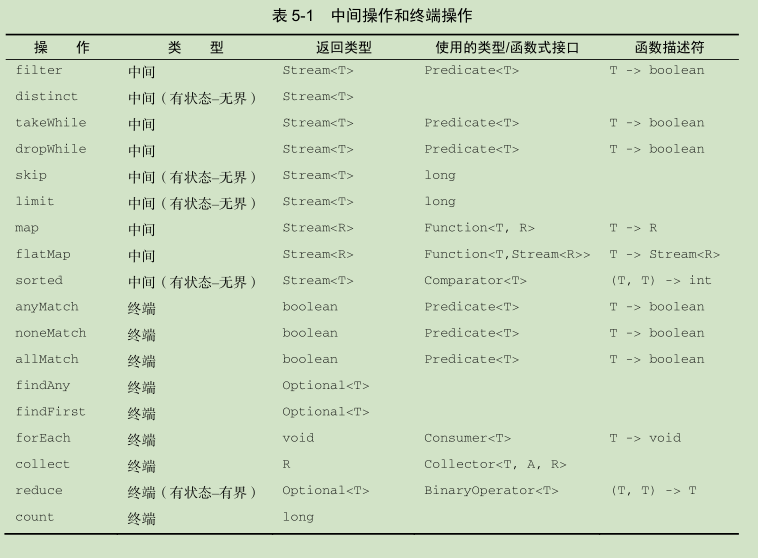

# 第一部分

1.  Java从函数式编程引入的两个核心思想：将方法和 Lambda作为一等值，以及
   在没有可变共享状态时，函数或方法可以有效、安全地并行执行。
   
2. 只定义一个抽象方法的的接口被称为**函数式接口**;

3. 用函数式接口可以干什么呢？Lambda 表达式允许你直接以**内联的形式**为函数式接口的抽象方法提供实现，并把整个表达式作为函数式接口的实例（具体说来，是函数式接口一个具体实现的实例）。

   1. ~~~java
      // 使用内联的方式
      Runnable r1 = () -> System.out.println("Hello World 1");
      // 使用匿名类
      Runnable r2 = new Runnable(){
      public void run(){
      System.out.println("Hello World 2");
      }
      };
      ~~~

4. 方法调用的返回值为空时，Java语言规范有一条特殊的规定。这种情况下，你不需要使用括号环绕返回值为空的单行方法调用.

   1. ~~~java
      // 常规写法
      process(() -> { System.out.println("This is awesome"); });
      // 特殊规定后的写法
      process(() -> System.out.println("This is awesome"));
      ~~~

5. 如果一个类上面标记有**@FunctionalInterface**,就说明他是一个函数式接口,编译器会进行检验,并报错.

6. 函数式接口中的任何一个都**不允许**抛出**受检异常**.

7. lambda表达式调用局部变量时:但局部变量必须显式声明为 final ，或**事实上是 final** 。换句话说，Lambda表达式只能捕获指派给它们的局部变量一次。

   1. ~~~java
      int portNumber = 1337;
      Runnable r = () -> System.out.println(portNumber);
      portNumber = 31337; // 错误：Lambda 表达式引用的局部变量必须是最终的（ final ）或事实上最终的
      ~~~

   2.  原因是:如果 Lambda可以直接访问局部变量，而且 Lambda是在一个线程中使用的，则使用 Lambda的线程，可能会在分配该变量的**线程将这个变量收回之后，去访问该变量**.第二个原因是如果不做限制会影响到并发.

8.  方法引用是指lambda表达式的缩写

    1.  方法引用主要有三类。
        (1) 指向**静态方法的方法**引用（例如 Integer 的 parseInt 方法，写作 Integer::parseInt ）。
        (2) 指向**任意类型实例方法**的方法引用（例如 String 的 length 方法，写作 String::length ）。
        (3) 指向**现存对象或表达式实例方法**的方法引用（假设你有一个局部变量 expensive Transaction。
    2.  第二种方法引用的思想是你在引用一个对象的方法.第三种方法引用主要用在你需要在 Lambda 中调用一个现存外部对象的方法时。Lambda 表达式 ()->expensiveTransaction.getValue() 可以重写为 expensiveTransaction::getValue 。第三种方法引用在你需要传递一个私有辅助方法时特别有用。

# 第二部分 

## 第四章

1. 常见的流操作

   - filter ——接受一个 Lambda，从流中排除某些元素。在本例中，通过传递 Lambda  d ->
     d.getCalories() > 300 ，选择出热量超过 300卡路里的菜肴。
     
   - map ——接受一个 Lambda，将元素转换成其他形式或提取信息。在本例中，通过传递方
     法引用 Dish::getName ，相当于 Lambda d -> d.getName() ，提取了每道菜的菜名。
     
   - limit ——截断流，使其元素不超过给定数量。

   - collect ——将流转换为其他形式。在本例中，流被转换为一个列表。

   - ~~~java
     List<String> names = menu.stream()
     .filter(dish -> dish.getCalories() > 300)
     .map(Dish::getName)
     .limit(3)
     .collect(toList());
     ~~~

   -  

2. 流只能消费一次

   1. ~~~java
      List<String> title = Arrays.asList("Modern", "Java", "In", "Action");
      Stream<String> s = title.stream();
      s.forEach(System.out::println);
      s.forEach(System.out::println);  //java.lang.IllegalStateException:
      ~~~

3. 使用流

   1. ~~~java
      // distinct 
      numbers.stream()
      .filter(i -> i % 2 == 0)
      .distinct()   // 它会返回一个元素各异
      .forEach(System.out::println);
      ~~~

   2.  不想用filter使元素排序并且只想知道,原始内容中第一个符合的元素,**takeWhile** 操作就是为此而生的！它可以帮助你利用谓词对流进行分片。更妙的是，它会在遭遇第一个不符合要求的元素时停止处理。(即将第一个不符合的元素之前的元素返回)

      1. ~~~java
         // takeWhile  切片
         List<Dish> slicedMenu1
         = specialMenu.stream()
         .takeWhile(dish -> dish.getCalories() < 320)
         .collect(toList());
         ~~~

   3. dropWhile 操作是对 takeWhile 操作的补充。它会从头开始，丢弃所有谓词结果为 false的元素。一旦遭遇谓词计算的结果为 true ，它就停止处理，并返回所有剩余的元素.

      1. ~~~java
         // dropWhile 切片
         List<Dish> slicedMenu2
         = specialMenu.stream()
         .dropWhile(dish -> dish.getCalories() < 320)
         .collect(toList());
         ~~~

   4. 截短流 limit 

   5. 跳过元素 skip

   6. 对流中每一个元素应用函数 map

   7.  flatMap 方法让你把一个流中的每个值都换成另一个流，然后把所有的流连接起来成为一个流。

      1. ~~~java
         List<String> uniqueCharacters =
         words.stream()
         .map(word -> word.split(""))
         .flatMap(Arrays::stream)
         .distinct()
         .collect(toList());
         ~~~

   8. 匹配 anyMatch,allMatch,noneMatch

      1. ~~~java
         // allMatch
         boolean isHealthy = menu.stream()
         .allMatch(dish -> dish.getCalories() < 1000);
         ~~~

   9. 查找元素 findAny  findFirst

      1. ~~~java
         // 方法将返回当前流中的任意元素  findAny
         Optional<Dish> dish =
         menu.stream()
         .filter(Dish::isVegetarian)
         .findAny();
         ~~~

   10. 归约 此类查询需要将流中所有元素反复结合起来，得到一个值，比如一个 Integer 。这样的查询可以被归类为**归约操作**（将流归约成一个值）。用函数式编程语言的术语来说，这称为**折叠**（fold）.

   11. reduce  求和,最大值,最小值

       1. ~~~java
          int sum = numbers.stream().reduce(0, Integer::sum);
          Optional<Integer> max = numbers.stream().reduce(Integer::max);
          Optional<Integer> min = numbers.stream().reduce(Integer::min);
          ~~~

   12. 中间操作和终端操作

       

   13. 原始类型流特化

       1. 使用map返回的Stream<T>,如果想直接返回我们需要的类型例如int,则使用mapToInt,直接返回int,避免了暗含的装箱成本.

          1. ~~~java
             int calories = menu.stream()
             .mapToInt(Dish::getCalories)
             .sum();		
             ~~~

       2. 转换回对象流  boxed()

          1. ~~~java
             IntStream intStream = menu.stream().mapToInt(Dish::getCalories);
             Stream<Integer> stream = intStream.boxed();
             ~~~

       3. 数值范围

          1. IntStream和LongStream的range和rangeClosed方法.rangeClosed 包含起始值.

   14. 创建流

       1. 由值创建流     Stream<String> stream = Stream.of("Modern ", "Java ", "In ", "Action");

       2. 可空对象创建流 

          1. Stream<String> homeValueStream= Stream.ofNullable(System.getProperty("home"));

       3. 数组创建流   int[] numbers = {2, 3, 5, 7, 11, 13};int sum = Arrays.stream(numbers).sum();

       4. 由文件生成的流

          1. ~~~java
             // 查询文件中有多少个不同的单词
             long uniqueWords = 0;
             try(Stream<String> lines =
             Files.lines(Paths.get("data.txt"), Charset.defaultCharset())){
             uniqueWords = lines.flatMap(line -> Arrays.stream(line.split(" ")))
             .distinct()
             .count();
             }
             catch(IOException e){
             }
             ~~~

          2.  Files.lines 得到一个流，其中的每个元素都是给定文件中的一行

       5. 无限流

## 第六章

1. ### 规约和汇总

   1. 数据流的总数   

      1. long howManyDishes = menu.stream().collect(Collectors.counting());
      2. long howManyDishes = menu.stream().count();

   2. 计算流中的最大值和最小值**maxBy** **minBy**

      1. menu.stream().collect(**maxBy**(dishCaloriesComparator));

   3. 汇总

      1. 求热量的总和	int totalCalories = menu.stream().collect(**summingInt**(Dish::getCalories));
      2. 同样方法可以换成 **summingDouble**,**averagingInt**等方法.
      3. 可以换成 **summarizingInt**,一次就能获取多个值 
         1. IntSummaryStatistics{count=9, sum=4300, min=120,average=477.777778, max=800}

   4. 连接字符串

      1. String shortMenu = menu.stream().map(Dish::getName).collect(joining(", ")); 也可以不加分隔符.

   5. reduce 和collect的比较  reduce适合于不变值,collect适合于在动态的变值规约.

      1. ~~~java
         // reduce
         int totalCalories = menu.stream()
             .collect(reducing(0, Dish::getCalories, (i, j) -> i + j));
         //参数 1 起始值  2 使用的函数将菜肴转换表示其所含热量的int 3 求和 
         ~~~

2. ### 分组

   1. ~~~java
      Map<Dish.Type, List<Dish>> dishesByType =
      menu.stream().collect(groupingBy(Dish::getType));
      ~~~

# 第三部分

## 第八章

1. 可以用Arrays.asList(1,2,3)快速的生成集合,但是所生成的集合**不能更改**.

2. list.replaceAll和boolean b = numList1.removeIf(x -> x.equals(2));java8引入的新方法,可以更方便的操作集合.

3. 操作Map  

   1. ~~~java
      // 直接遍历Map的Key和Value
      ageOfFriends.forEach((friend, age) -> System.out.println(friend + " is " +age + " years old"));
      ~~~

   2. ~~~java
      // 通过Map的key排序
      favouriteMovies
      .entrySet()
      .stream()
      .sorted(Entry.comparingByKey())
      .forEach(System.out::println);
      ~~~

   3.  **getOrDefault** 以接受的第一个参数作为键，第二个参数作为默认值（在 Map 中找不到指定的键时，该默认值会作为返回值).

   4.   **computeIfAbsent** ——如果指定的键没有对应的值（没有该键或者该键对应的值是空），那么使用该键计算新的值，并将其添加到 Map 中；
      computeIfPresent ——如果指定的键在 Map 中存在，就计算该键的新值，并将其添加到 Map 中；
      compute ——使用指定的键计算新的值，并将其存储到 Map 中。

   5. favouriteMovies.**remove**(key, value); map中直接删除元素.**removeIf**方法也支持

   6. **replace**和**replaceAll**

## 第九章 重构 测试和调试

1. 取代匿名类

   1. 首先，匿名类和 Lambda表达式中的 this 和 super 的含义是不同的。在匿名类中， this 代表的是类自身，但是在 Lambda中，它代表的是包含类。其次，匿名类可以屏蔽包含类的变量，而 Lambda表达式不能.

   2. 尝试使用静态的方法

      1. ~~~java
         inventory.sort((Apple a1, Apple a2) -> a1.getWeight().compareTo(a2.getWeight()));
         // 第二种更好
         inventory.sort(comparing(Apple::getWeight));
         ~~~

   3. 尝试使用归约操作

      1. ~~~java
         int totalCalories =menu.stream().map(Dish::getCalories)
             .reduce(0, (c1, c2) -> c1 + c2);
         // 第二种更好
         int totalCalories = menu.stream().collect(summingInt(Dish::getCalories));
         ~~~

   4. **peek** 可以输出流操作前和操作后的值.

## 第十二章  新的日期和时间API

1. ~~~java
   // 指定格式的格式化时间
   LocalDateTime time2 = LocalDateTime.of(2021, 12, 12, 12, 12, 12);
           DateTimeFormatter dateTimeFormatter = DateTimeFormatter.ofPattern("yyyy/MM/dd HH:mm:ss");
   String time = localDateTime.format(dateTimeFormatter);
   ~~~

2. **localDate** 是日期的 例如2021-04-09 **localTime**  是处理时间的 例如 10:55:51 他们都可以通过**of**方法创建.

3. 日期和时间的合并    date.**atTime**(12,24,12)   time.**atDate**(date)  .通过atTime 和atDate的方法实现相互的转换,也可以通过 **LocalDateTime.of**(date,time) 来实现直接创建时间.

## 第十三章 默认方法

1. 当需要向接口中添加方法时,所有的实现此接口的类都需要被动的改变,为了避免这一情况,java8提供了两种的解决方法其一，Java 8允许在接口内声明**静态方法**。其二，Java 8引入了一个新功能，叫**默认方法**,通过默认方
   法你可以指定接口方法的默认实现。换句话说，**接口能提供方法的具体实现**。因此，实现接口的类如果不显式地提供该方法的具体实现，就会**自动继承默认的实现**。
2. 默认方法使用**default**关键字.
3. **并发与并行**这两种算法的差异。并发是一种编程属性（重叠地执行），即使在单核的机器上也可以执行，而并行是执行硬件的属性（同时执行）。

