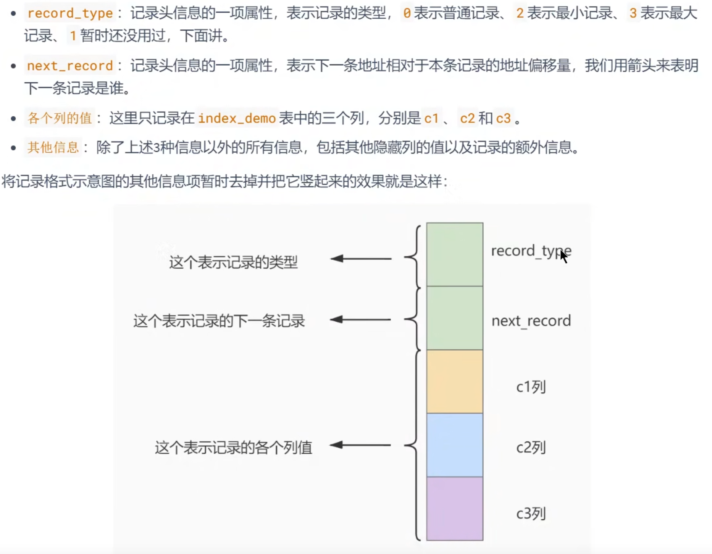
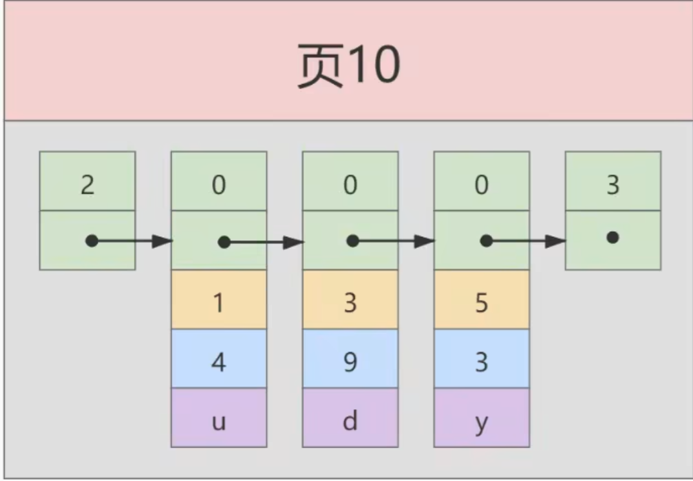
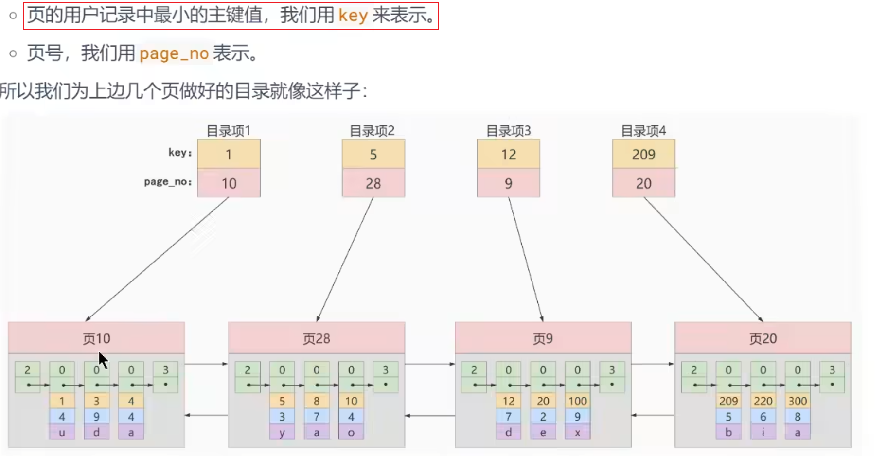
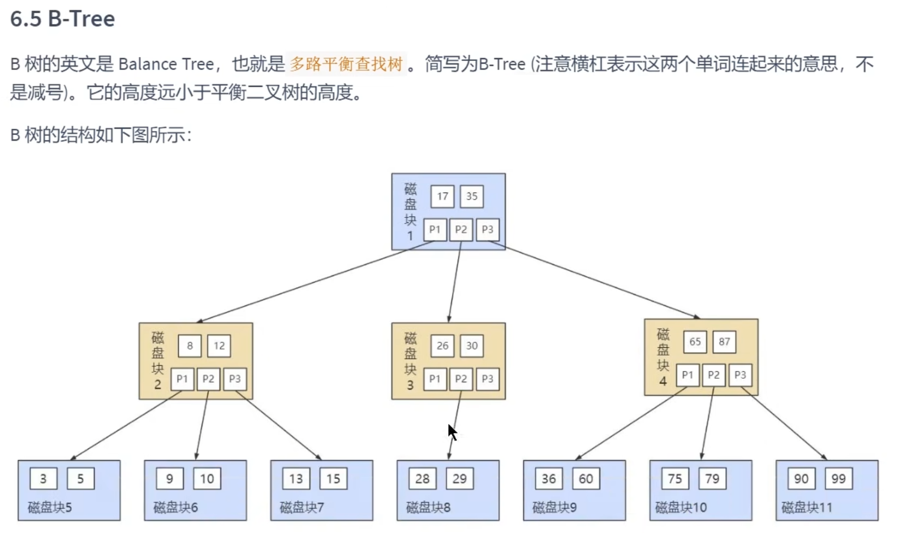
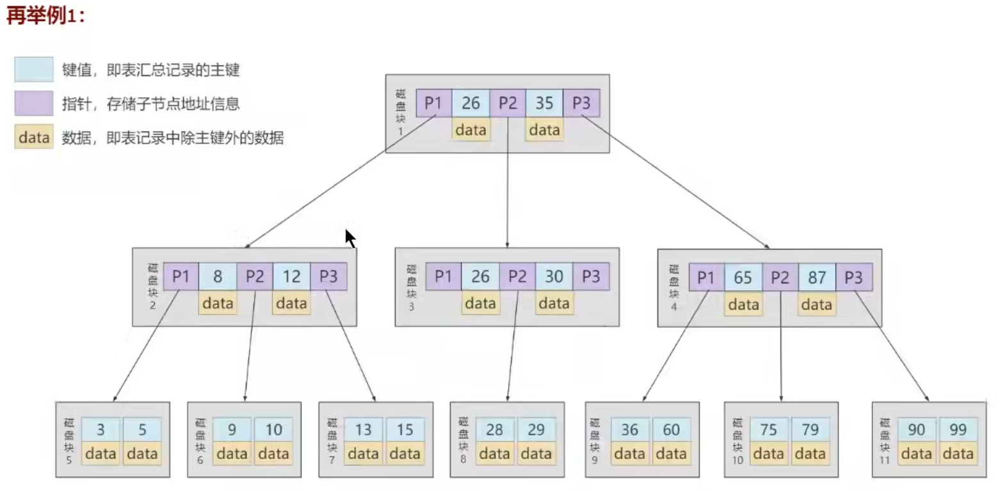
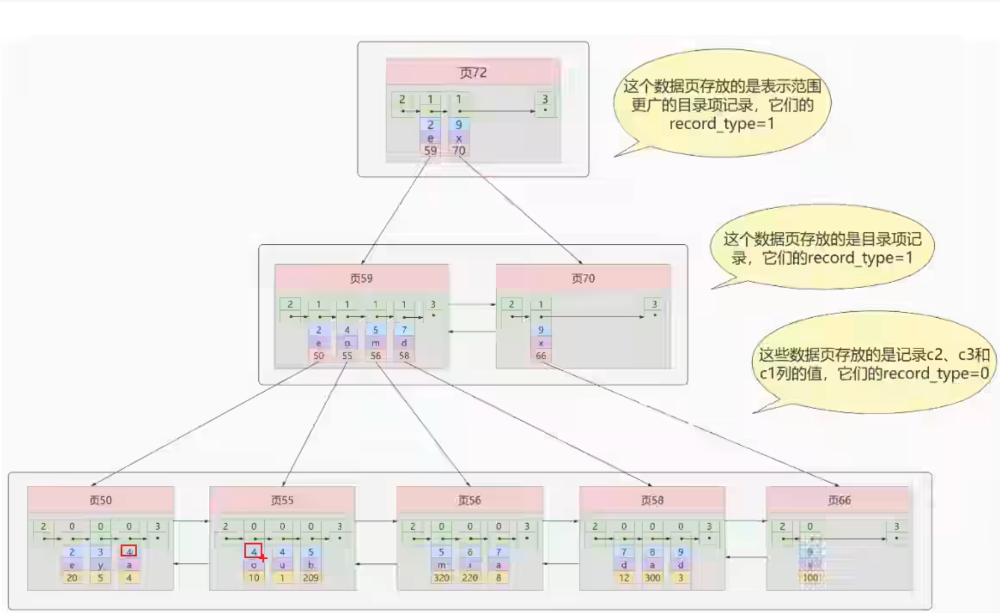
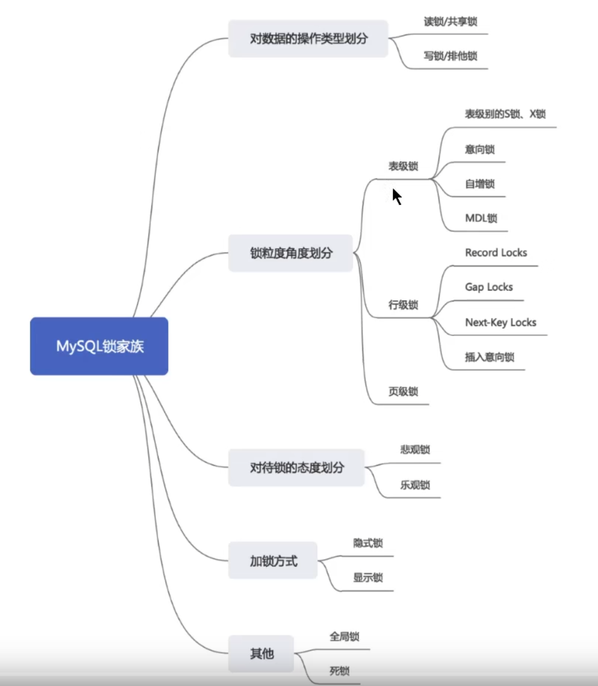
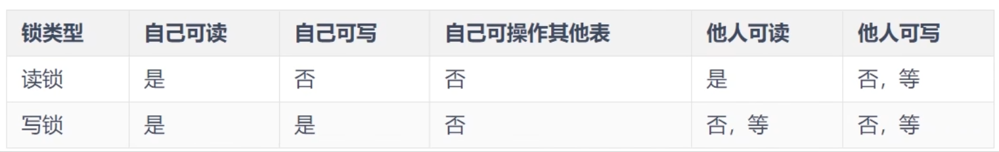
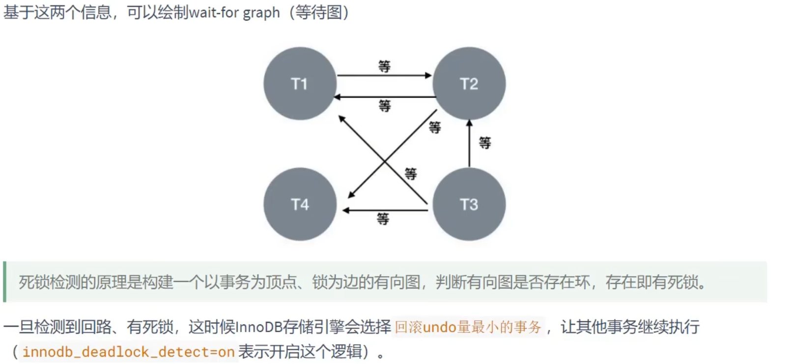

# Mysql知识点

## 基本概念

1. ### 何时创建索引

   1. 主键自动简历唯一索引.
   2. 频繁作为查询条件的字段应该创建索引.
   3. 查询与其他表关联的字段,外键关联建立索引.
   4. 频繁更新的字段不适合创建索引.
   5. Where条件里用不到的字段不创建索引.

2. ### 常用函数

   1. DISTINCT  将重复的数据去掉.

   2. IF(expr1,expr2,expr3)  expr1是true,则if返回expr2,否则返回expr3.

   3. IFNUll(expr1,expr2)  如果expr1不为NUll返回expr1,否则返回expr2

      1. SELECT IFNULL(NULL,10);  返回值10.

   4. INSTR(str,substr)  返回在str中第一次出现substr的位置,如果找不到返回0

      1. SELECT INSTR('football','ball');  返回 5

   5. FLOOR(数值) 取整函数

      1. SELECT FLOOR(78.99);  78

   6. cast()类型转换函数  支持的转换的类型有binary,char,date,time,datetime,signed,unsigned(无符号值即为非负数).

   7. group_concat() 和并列函数 例如一个学生有多门成绩,可以合并到一起显示,可以自定义分隔符和进行排序.

      1. SELECT score.`学号`,GROUP_CONCAT(score.`成绩`) FROM score GROUP BY score.`学号`;

   8. ROUND() 四舍五入函数

   9. TRUNCATE(x,y)  返回数值x保留小数点后y位的值,不会进行四舍五入.

   10. Left(str,length),Right(str,length),substring(str,pos,length).截取字符串.

   11. CASE WHEN函数   END 

       1. CASE   
          WHEN [condititonal test 1] THEN [result1] 
          WHEN [condititonal test 2] THEN [result2] 
          ELSE [result3] 

          END

3. ### Sql语句进阶

   1. SELECT CASE pref_name
      WHEN '德岛' THEN '四国'
      WHEN '香川' THEN '四国'
      WHEN '爱媛' THEN '四国'
      ELSE '其他' END AS **district**,
      SUM(population)
      FROM PopTbl
      GROUP BY **district**;
      使用case when 的别名,进行分组,防止一处更改而忘了另一处.
   2. 约束 主键约束  唯一约束  check约束的 ,CONSTRAINT(外部连接约束) 一般会在建表的时候进行检验.
   3. 内连接和外连接的区别,如果通过价格排序table1.price<table2.price**,使用内连接会把第一的价格过滤掉.**
   4. 为什么判断null值是 is null 但不是 = null ,这是因为，NULL 既不是值也不是变量。NULL 只是一个表示“**没有值**”的标记，**而比较谓词只适用于值**。因此，对并非值的 NULL 使
      用比较谓词本来就是没有意义的
   5. 真值 unknown 和作为 NULL 的一种的UNKNOWN （未知）是不同的东西。前者是明确的布尔型的真值，后者既不是值也不是变量.
   6. In和exists可以等价互换,但是not in 和not Exists不能等价互换,原因是由null的存在,如果age not in(12,13,null),这个永远返回null,而exists会返回结果**,exist是经过处理的,只会返回true或者false**,永远不会返回unknown.
   7. **All  是许多and 连接的省略的写法**.有时候可以用极值函数(MAX MIN) 代替ALL,但是如果没有符合极值的条件,则没有返回值,然而我们想要的正确结果是第一个表的所有值.
      1. ALL 谓词：他的年龄比在东京住的所有学生都小 
         极值函数：他的年龄比在东京住的年龄最小的学生还要小 
   8. **COUNT(*) 包含NULL值,COUNT(列名) 不包含空值.**
   9. **WHERE 子句用来调查集合元素的性质(行元素的值)，而 HAVING 子句用来调查集合本身的性质(一般会分组查询的时候使用)**。
   10. 关联子查询和自连接在很多时候都是等价的.
   11. group by 分组后会形成新的视图,通常不能沿用原表的索引.所以使用where代替Having可是是性能更好.
   12. !=和not in 不能用到索引.
   
4. ### Sql 练习语句

   1. ~~~sql
      SELECT score.`学号`,COALESCE(NULL,score.`成绩`) AS good FROM score;
      SELECT 1,2,3 CROSS JOIN 2;
      CASE sex
      	WHEN 1 THEN '男' ,
      	WHEN 2 THEN '女'
      	ELSE '其它'
      	END;
      #按市统计男女数
      SELECT CASE WHEN sex=1 THEN '男' ELSE '女' END,SUM(sex) FROM TABLE GROUP BY sex;
      SELECT pre_name,SUM(CASE WHEN sex =1 THEN pop ELSE 0 END) AS '男',SUM(CASE WHEN sex =2 THEN pop ELSE 0 END) AS '女' FROM TABLE GROUP BY pre_name,
      ## 课程考试表
      SELECT course_name FROM coursemaster WHERE course_id IN()
      SELECT 
        course_id,
        CASE MONTH
          WHEN '200706' 
          THEN '6月'
          WHEN '200707' 
          THEN '7月'
          WHEN '200708' 
          THEN '8月' ELSE '其它' END AS TIME
          FROM  opencourse;
        #正确的解法
        SELECT course_name ,CASE WHEN course_id IN (SELECT course_id  FROM opencourse WHERE MONTH ='200706') THEN 'o' ELSE '×' END AS '6月' FROM coursemaster;
        SELECT A.course_name,CASE WHEN EXISTS (SELECT course_id  FROM opencourse B  WHERE  B.MONTH ='200706' AND A.course_id =B.course_id ) THEN 'o' ELSE '×' END AS '6月' FROM coursemaster A;
        ##只参加一个社团的学生
        SELECT std_id,MAX(clbu_id) FROM studentclub GROUP BY std_id HAVING COUNT(*)=1;
        ##参加了多个社团的
        SELECT std_id FROM studentclub WHERE main_club_flg ='Y';
        ## 查询出所有学生参加的主社团
        SELECT std_id ,CASE WHEN COUNT(*)=1 THEN MAX(clbu_id) ELSE MAX(CASE WHEN main_club_flg='Y' THEN clbu_id ELSE NULL END ) END AS 'mainclub' FROM studentclub GROUP BY std_id;
      ## greatest 列中最大的值
      SELECT GREATEST(X,Y,z) FROM greaters;
      SELECT CASE WHEN (CASE WHEN X<Y THEN Y ELSE X END) <z THEN z ELSE (CASE WHEN X<Y THEN Y ELSE X END)END AS greater FROM greaters;
      ##根据价格对products排序 跳过相同排名和不跳过相同排名
      SELECT P1.name,P1.price,(SELECT COUNT( DISTINCT P2.price) FROM products P2 WHERE P2.price >P1.price)+1 AS ranks  FROM products P1 ORDER BY ranks;
      SELECT COUNT(price) FROM products;
      SELECT P1.name, P2.name FROM products P1 LEFT OUTER JOIN  products P2 ON P2.price >P1.price;
      ~~~

## 存储引擎

1. InnoDB Vs MyISAM

   1. | **特性**     | **InnoDB**                         | **MyISAM**                   |
      | ------------ | ---------------------------------- | ---------------------------- |
      | **事务支持** | **支持 (ACID)**                    | 不支持                       |
      | **锁定粒度** | **行级锁 (Row-level)**             | 表级锁 (Table-level)         |
      | **外键支持** | **支持**                           | 不支持                       |
      | **崩溃恢复** | **支持 (依赖 Redo Log)**           | 不支持（崩溃后容易损坏数据） |
      | **存储结构** | **聚簇索引**（数据与索引存放一起） | 非聚簇索引（数据与索引分开） |
      | **全文索引** | 支持（5.6 以后）                   | 支持                         |
      | **关注点**   | 事务、并发、数据安全               | 性能、读取速度（旧时代结论） |

   2. InnoDB  索引即数据 加载索引的时候需要更多的内存.

## 索引

1. 索引是排好序的数据结构.
2. 行格式(Compact)
   1. `record_type`:记录头信息的一项属性，表示记录的类型，`0`表示普通记录、`2`表示最小记录、`3`表示最大记录,`1`表示页.
      `next_record`:记录头信息的一项属性，表示下一条地址相对于本条记录的地址偏移量，我们用箭头来表明下一条记录是谁。
      `各个列的值`:这里只记录在index_demo表中的三个列，分别是c1、c2和c3。
      `其他信息`:除了上述3种信息以外的所有信息，包括其他隐藏列的值以及记录的额外信息。
   2. 

3. 数据页模型
   1. 
   2. 主键递增,数据与数据之间是单向链表.
   3. 
   4. 页与页之间(叶子节点和非叶子节点)的结构是双向链表.默认大小16kb. 

4. B+Tree结构

2. 普通索引和二级索引数据结构 
   1. 
3. 复合索引数据结构
   1. 
   2. 组合索引非叶子节点存储的是联合索引的值,叶子节点比非叶子节点多了一个主键,命中的数据,更具主键在进行回表查询.
4. B-Tree和B+Tree的区别
   1. B-Tree 是叶子节点和非叶子节点都存储数据的.
   2. B+Tree 是只有叶子节点存储数据.因为非叶子节点不存储数据,所以可以存更多的索引key,会使索引更加的聚合,查询效率会更高.
   2. **B+Tree 叶子节点和非叶子节点都有record_type ,next_record及数据结构.不同的是非叶子存储的是子页的信息.**
   3. B-Tree
      1. 
      2. 
      3. 26,35是主键,p1 是页的索引,比26小的,p2是大于26,小于35,剩下的是大于35的页索引.
      4. 由于B-Tree非叶子节点也存储数据.26就存等于它自己的值.

---

~~~sql
##表设计
desc your_table_name
##展示索引
SHOW INDEX FROM your_table_name;
~~~

1. 二级索引
   1. 二级索引的非叶子节点是与聚簇索引结构一致,但并不是存储主键的值,而是用哪个字段建索引了就存哪个字段的值.
   2. 叶子节点数据记录是用于检索的建立索引的列值和主键.通过主键再到聚簇索引中查找对应的数据.
2. 联合索引
   1. 用c2,c3建立索引,先用c2进行排序,如果c2一样,在用c3进行排序.
   2. 
3. **索引唯一性**
   1. 如果查询一条数据 无法再非叶子节点判断页的位置,例如c2,c3的都与页中数据一致.为了保证唯一性,Innodb自动给我们增加一个主键的维度. 保证索引的唯一性

## 事务日志

1. 事务的**隔离性**由 锁机制 实现。而事务的**原子性、一致性和持久性**由事务的 redo 日志和undo 日志来保证。

   - REDO LOG 称为 重做日志 ，提供再写入操作，恢复提交事务修改的页操作，用来保证事务的持
     久性。(内存中的数据进行修改后,记录在了REDO日志中,如果数据库崩溃,可以通过日志进行恢复)
   - UNDO LOG 称为 回滚日志 ，回滚行记录到某个特定版本，用来保证事务的原子性、一致性。

2. | **特性**     | **Redo Log (重做日志)**                                      | **Undo Log (回滚日志)**                                      |
   | ------------ | ------------------------------------------------------------ | ------------------------------------------------------------ |
   | **主要目的** | **持久性 (Durability)**：确保已提交的事务不丢失。            | **原子性 (Atomicity)**：确保事务可以回滚；**隔离性**：实现 MVCC。 |
   | **记录内容** | **物理日志**：记录的是“在哪个数据页的哪个偏移量做了什么修改”。 | **逻辑日志**：记录的是操作的反向逻辑（如 Insert 对应 Delete）。 |
   | **生效时机** | 事务执行过程中不断写入，**崩溃恢复**时使用。                 | 事务开始前生成，**回滚**或**读取旧版本数据**时使用。         |
   | **存储形式** | 循环覆盖写（文件大小固定）。                                 | 存储在段（Undo Segment）中，属于元数据。                     |
   | **比喻**     | 像“施工日志”：记下哪块砖动了，停电后按日志补齐。             | 像“悔棋记录”：记下刚才走了哪步，想反悔时按记录退回。         |

3. Redo Log：应对“天灾”（掉电/宕机）:在改内存的同时，先把修改动作写进 Redo Log。因为 Redo Log 是顺序追加写，速度极快（WAL技术）。如果停电,可以从日志中恢复数据.

4. Undo Log：应对“人祸”或“并发”:回滚到上一个版本.

## 	MVCC

1. MVCC:多版本并发控制.

   1. 它的核心思想是：**通过保留数据的历史版本，实现“读-写”操作的不冲突**，从而在保证隔离性的同时大幅提升并发性能。
   2. **MVCC 的改进**：实现了**非阻塞读取**。在读操作（快照读）时，不需要加锁，可以直接读取历史版本，从而极大地提高了系统的吞吐量。
   2. **隐藏字段,Undo Log 版本链,Read View.**

2. 核心判断逻辑

   1. Read View 的核心任务是判断：**“这个版本的创作者（`trx_id`）在我的快照创建时，是否已经提交了？”**

      当你进行快照读（SELECT）时，系统会顺着版本链从新往旧找：

      1. **取出一个版本的 `trx_id`**。
      2. **看它在不在 Read View 的活跃列表（m_ids）里**

3. 隐藏字段:分别是事务id,**回滚段的指针**和主键.

   1. **`trx_id`**：每次一个事务对某条聚簇索引记录进行改动时，都会把该事务的 **事务 id** 赋值给 `trx_id` 隐藏列。
   2. **`roll_pointer`**：每次对某条聚簇索引记录进行改动时，都会把旧的版本写入到 **undo日志** 中，然后这个隐藏列就相当于一个指针，可以通过它来找到该记录修改前的信息。

4. undo_log:事务**未提交**,每次更改值都会产生一条日志,格式与隐藏字段一致.

5. MVCC只作用在RC和RR的事务的隔离级别,它们涉及到快照读.当select发生的时候,会生成一个readView读视图,注意与活跃的事物ID有关.读视图的结构是分别是:
   1. **creator_trx_id**:创建这个Read View的事务ID.只有在对表的记录做改动时,才会分配事务ID,否则在一个只读的事务id值默认为0.
   2. **trx_ids:**表示在生成ReadView时当前系统中**活跃的**读写事务的**事物id列表**
   3. **up_limit_id**:**活跃事物**中最小的事务ID.
   4. **low_limit_id:**表示生成ReadView时系统中应该分配给下一个事务的id值.low_limit_id是**系统的最大事物的ID**,不是活跃的事务ID.

6. ReadView的规则
   1. 有了这个ReadView，这样在访问某条记录时，只需要按照下边的步骤判断记录的某个版本是否可见。
      **trx_id是从查询数据的事务id进行获取,如果不满足需要从undo_log日志中获取**.如果被访问版本的trx_id属性值与ReadView中的 creator_trx_id 值相同，意味着当前事务在访问
      它自己修改过的记录，所以该版本可以被当前事务访问。
   2. 如果被访问版本的trx_id属性值小于ReadView中的 up_limit_id 值，表明生成该版本的事务在当前
      事务生成ReadView前已经提交，所以该版本可以被当前事务访问。
   3. 如果被访问版本的trx_id属性值大于或等于ReadView中的 low_limit_id 值，表明生成该版本的事
      务在当前事务生成ReadView后才开启，所以该版本不可以被当前事务访问。
   4. 如果被访问版本的trx_id属性值在ReadView的 up_limit_id 和 low_limit_id 之间，那就需要判
      断一下trx_id属性值是不是在 trx_ids 列表中。
   5. 如果在，说明创建ReadView时生成该版本的事务还是活跃的，该版本不可以被访问。
      如果不在，说明创建ReadView时生成该版本的事务已经被提交，该版本可以被访问

7. ReadView的规则简述版

   1. 当你执行 `SELECT` 时，InnoDB 会生成一个 Read View，包含四个关键指标：

      1. **m_ids**：当前系统里活跃（还没提交）的事务 ID 列表。
      2. **min_trx_id**：m_ids 里的最小值。
      3. **max_trx_id**：系统准备分配给下一个事务的 ID 值。
      4. **creator_trx_id**：生成这个 Read View 的事务 ID。

      **判定逻辑如下：**

      - **trx_id == creator_trx_id**：这行是我自己改的，**可见**。
      - **trx_id < min_trx_id**：这个版本在我的事务开始前已经提交了，**可见**。
      - **trx_id >= max_trx_id**：这个版本是在我的事务开启后才产生的，**不可见**。
      - **min_trx_id <= trx_id < max_trx_id**：
        - 如果 `trx_id` 在 `m_ids` 中：说明修改这行的事务还没提交，**不可见**。
        - 如果 `trx_id` 不在 `m_ids` 中：说明修改这行的事务已经提交，**可见**。
      - 如果当前版本不可见，引擎就顺着 `roll_pointer` 找上一个版本，重复上述判断，直到找到可见版本或返回空。

8. RR隔离级别是事务之后**第一个** SELECT 语句生成ReadView,RC是事务是**每条**  SELECT 语句都会生成ReadView.所以RR解决了**不可重复读和幻读**的问题.

9. 快照读:在快照中进行读取,当前读:读取当前最新的值.

## 锁

1. MVCC主要解决的是读写冲突的问题.

   1. 每次select都生成一个ReadView视图,查询语句只能`读`到在生成ReadView之前,已提交事务所做的更改.避免了脏读.
   2. 可重复读:一个事物在执行过程中只有第一次执行select操作,才生成一个ReadView,避免了`不可重复读`和`幻读`的问题.

2. 锁的分类

   1. 

   2. 共享锁(Shared Lock, S锁) 排它锁(Exclusive Lock,X Lock)

      1. ~~~sql
         select ... lock in SHARE MODE;
         select ... FOR SHARE;(8.0)
         ~~~

      2. ~~~SQL
         SELECT * FROM product where id =1  FOR UPDATE;
         ~~~

   3. 表级锁,页级锁,行锁.

      1. 表级别锁

         1. ~~~sql
            lock tables tableName1 read;
            unlock tables;
            ~~~

         2. 

      2. 意向锁:

         1. 在数据表的场景中，如果我们给某一行数据加上了`排它锁`，数据库会自动给更大一级的空间，比如数据页或数据表加上意向锁，告诉其他人这个数据页或数据表已经有人上过排它锁了，这样当其他人想要获取数据表排它锁的时候，只需要了解是否有人已经获取了这个数据表的意向排他锁即可。

            1. 如果事务想要获得数据表中某些记录的共享锁，就需要在数据表上添加`意向共享锁`。
            2. 如果事务想要获得数据表中某些记录的排他锁，就需要在数据表上添加`意向排他锁`.

         2. **规律 1：** 意向锁之间（IS 与 IX，IX 与 IX）永远**相互兼容**。因为它们只是“意向”，并不真正锁死数据，多个事务可以同时在同一张表的不同行上工作。

            **规律 2：** 意向锁与表级的 `X` 锁永远**冲突**。

            **规律 3：** `IX` 与表级的 `S` 锁**冲突**（因为我要改数据，你不能来全表只读）。

         3. 在低层级加锁,要对高层级打个招呼,这样如果相对表加锁,就不需要遍历整张表,是否某一行数据有锁导致我需要等待.

      3. 间隙锁

         1. **间隙锁（Gap Lock）** 是 MySQL InnoDB 存储引擎在 **可重复读（Repeatable Read, RR）** 隔离级别下，为了解决**幻读（Phantom Read）**而引入的一种锁机制。

      4. 临键锁

         1. 有时候我们既想锁住某条记录，又想阻止其他事务在该记录前边的间隙插入新记录，所以InnoDB就提出了一种称之为 Next-Key Locks的锁,官方的类型名称为:LOCK_ORDINARY，我们也可以简称为next-key锁.

   4. 乐观锁,悲观锁

      1. 注意:select ....for update语句执行过程中所有扫描的行都会被锁上，因此在MySQL中用悲观锁必须确定使用了索引，而不是全表扫描，否则将会把整个表锁住。
      2. 乐观锁的版本号/时间戳机制

   5. 隐式锁

   6. 死锁

      1. 死锁检测:

## Explain

### ID

1. 一般的情况下,如果语句不重新写,select语句中 有几个select就有几个ID.
2. ID号相同 从上到下执行
3. ID号越大优先级越高,越先执行.

### select_type

1. 每一个小查询(select)的角色.
2. simple(单表)
3. union 查询 最左边的表(驱动表)是primary.右边的表叫做union.临时表为union result.

### type

1. `system`:如果引擎是MyISAM. 直接从索引上返回数据了.

2. `const`:根据主键或者唯一二级索引列与常数进行等值匹配时,对单表的访问方法就是

3. `eq_ref`:如果被驱动表是通过'const'那种方式匹配的.

4. `ref`:普通的二级索引与常量进行等值匹配时来查询某个表.

5.  `index_merge`:用Or拼接的两个条件都是索引

6. `unique_subquery`是针对在一些包含`IN`子查询的查询语句中，如果查询优化器决定将`IN`子查询转换为`EXISTS`子查询，而且子查询可以使用到主键进行等值匹配的话，那么该子查询执行计划的`type`列的值就是`unique_subquery`

   1. ~~~sql
      EXPLAIN SELECT * FROM s1
      WHERE key2 IN (SELECT id FROM s2 WHERE s1.key1 = s2.key1 OR key3 = 'a';
      ~~~

7. `range`：使用的索引是范围的

   1. ~~~sql
      EXPLAIN SELECT * FROM s1  where key1 in ('a','b','c');
      ~~~

8. `index`:当我们可以使用索引覆盖，但需要扫描全部的索引记录时(不能直接使用联合索引(a,b,c),但是需要查询c,就把索引全部查询一遍)，该表的访问方法就是`index` 

   1. ~~~sql
      EXPLAIN SELECT key_part2 FROM s1 WHERE key_part3 = 'a';
      ~~~

9. `all`:全表扫描

### possible_key和key

1. 并不是选择越多越好

### key_length

1. 主要针对的是**联合索引**,值越大越好.

### ref

1. ref：当使用索引列等值查询时，与索引列进行等值匹配的对象信息。 # 比如只是一个常数或者是某个列。
   1. `const`：表示匹配的是一个常量（如`WHERE id = 1`中的`1`）；
   2. 列名：表示匹配的是另一张表的列（如关联查询中`ON a.id = b.a_id`的`b.a_id`）；
   3. `func`：表示匹配的是一个函数或表达式的结果。

### rows

1. 预估的需要读取的记录数.

### filtered

1. 某个表经过搜索条件过滤后剩余记录条数的百分比.越大越好
2. 单表查询没有意义,更关注连接查询中,决定了被驱动表要执行的次数.(rows*filtered)

### Extra

1. 查询列表中有where条件 且 where人条件字段不是索引,显示`where`

2. 在连接查询执行过程中，当被驱动表不能有效的利用索引加快访问速度，MySQL一般会为其分配一块名叫“连接缓冲区’的内存块来加快查询速度，也就是我们所讲的、基于块的嵌套循环算法

   1. ~~~sql
      EXPLAIN SELECT FROM s1 INNER JOIN s2 ON s1.common field = s2.common field;
      ~~~

### show warnings

1. 查询优化器优化后的sql语句.

